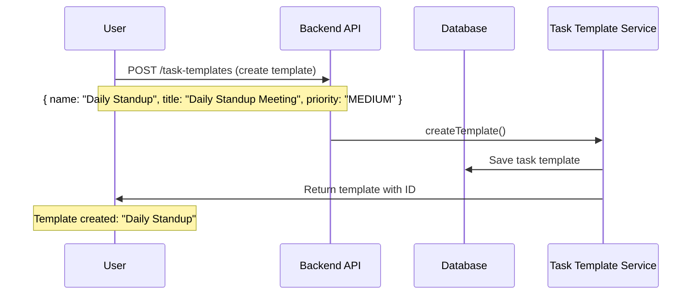
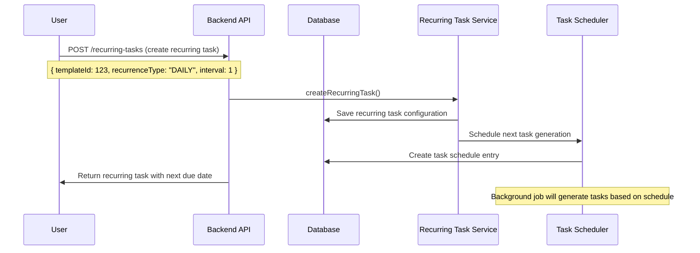
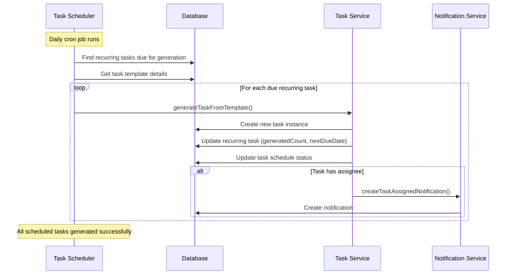
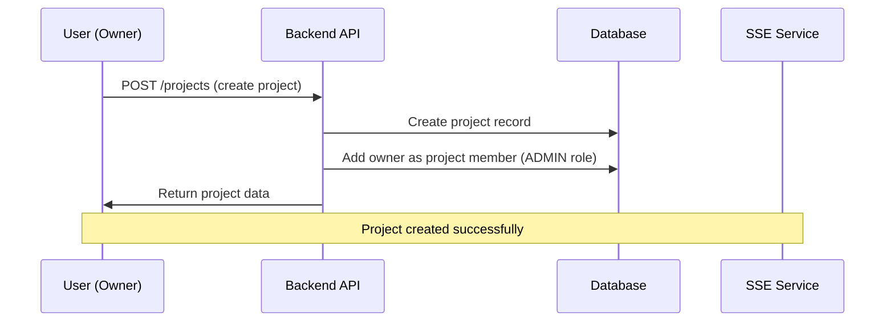
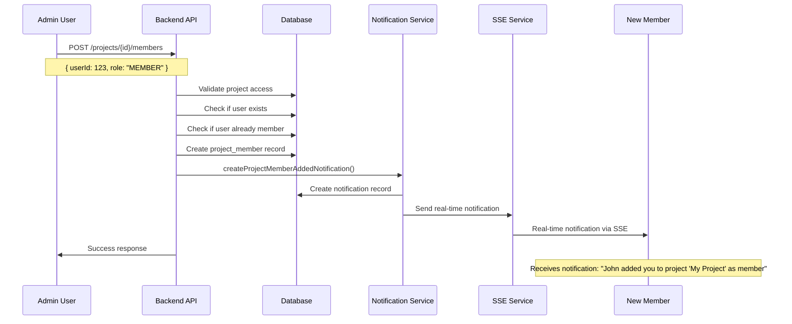
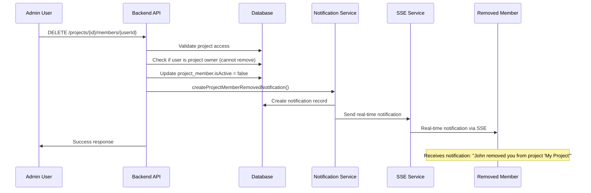
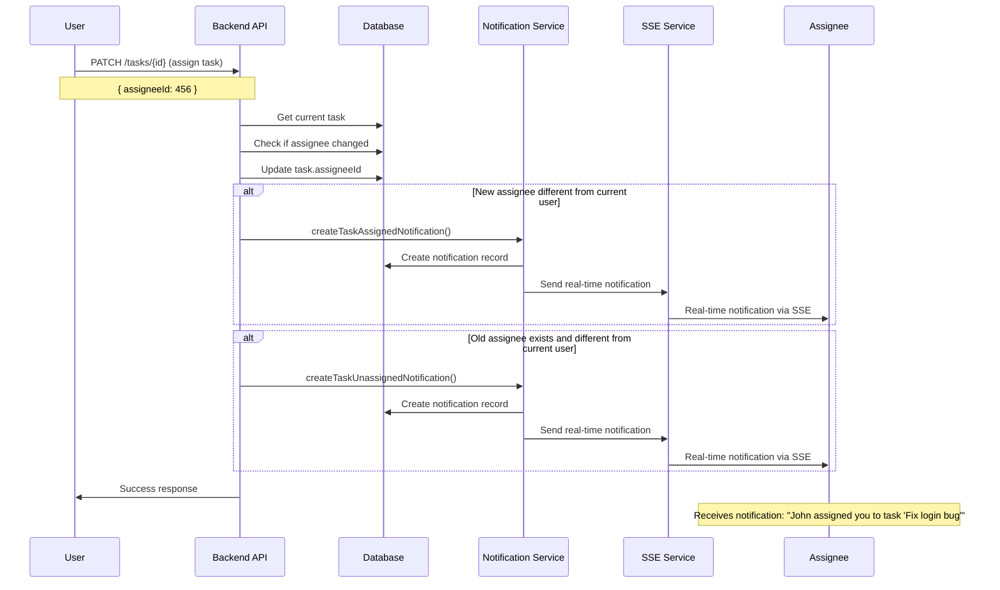
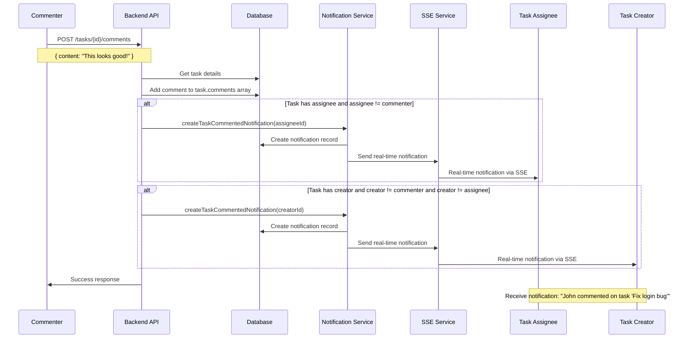

# 🚀 Kanban Backend System

A Kanban project management system built with NestJS, TypeORM, and MySQL. The system is designed to support multiple projects with flexible and customizable Kanban boards.

## 📋 Table of Contents

- [Features](#-features)
- [Architecture](#-architecture)
- [Database Design](#-database-design)
- [Task Templates & Recurring Tasks Workflow](#-task-templates--recurring-tasks-workflow)
- [Project Member Management & Notification Flow](#-project-member-management--notification-flow)
- [API Documentation](#-api-documentation)
- [Installation](#-installation)
- [Configuration](#-configuration)
- [Development](#-development)
- [Error Codes](#-error-codes)

## ✨ Features

### 🔐 Authentication & Authorization
- **JWT-based Authentication**: Access token (15 minutes) + Refresh token (7 days)
- **Role-Based Access Control (RBAC)**: Permission system based on module-action
- **Permission System**: `module:action` format (e.g., `project:create`, `task:edit`)
- **Super Admin**: Permission `all:all` can access everything
- **Cookie Security**: HTTP-only cookies, secure, sameSite strict

### 🏗️ Project Management
- **Multi-Project Support**: Support multiple projects simultaneously
- **Project Roles**: Owner, Admin, Member, Viewer
- **Member Management**: Add/remove project members with real-time notifications
- **Project Settings**: Flexible configuration for each project
- **Project Avatars**: Custom project images

### 👤 User Management
- **User Profiles**: Username, email, full name, avatar
- **Avatar Support**: Profile pictures for users
- **Account Verification**: Email verification system

### 📊 Kanban Board System
- **Dynamic Columns**: Create/delete/edit status columns flexibly
- **Custom Status Workflows**: Not limited by fixed statuses
- **Column Rules**: Rules for each column (WIP limits, permissions)
- **Drag & Drop**: Arrange tasks within columns and between columns

### 📝 Task Management
- **Flexible Task Fields**: Title, description, priority, labels, attachments
- **Task Assignment**: Assign tasks to members with real-time notifications
- **Task Comments**: Comment system for tasks with notifications
- **Custom Fields**: Flexible custom fields
- **Time Tracking**: Track estimated and actual time
- **Task Templates**: Reusable task templates for consistent task creation
- **Recurring Tasks**: Automated task generation with flexible scheduling
- **Task Scheduling**: Advanced scheduling system for recurring workflows

### 🔔 Real-time Notifications (SSE)
- **Server-Sent Events**: Real-time notifications via SSE
- **Project Notifications**: Member added/removed, project invites
- **Task Notifications**: Task assigned/unassigned, moved, commented
- **Rich Metadata**: User avatars, project names, task titles
- **Connection Management**: Multi-client support with heartbeat

### 🔒 Security & Data Integrity
- **Transaction Support**: Ensure data integrity
- **Input Validation**: Class-validator with DTOs
- **Global Error Handling**: Standard response format
- **CORS Configuration**: Secure cross-origin requests

### 📁 File Management
- **Avatar Uploads**: User and project avatars
- **File Validation**: Size and type restrictions
- **Secure Storage**: Local file system with organized structure
- **Temporary Files**: Support for temporary file uploads

## 🏛️ Architecture

### **Current Module Structure**
```
src/
├── app.module.ts                    # Root module
├── main.ts                          # Application entry point
├── config/                          # Configuration files
├── common/                          # Shared utilities
│   ├── constants/                   # Error codes, constants
│   ├── filters/                     # Exception filters
│   ├── interceptors/                # Response transformers
│   ├── interfaces/                  # Type definitions
│   ├── services/                    # Shared services (file upload)
│   └── dto/                        # Shared DTOs
├── entities/                        # Database entities
├── auth/                           # Authentication module
├── projects/                       # Project management module
├── kanban/                         # Kanban board & column module
├── tasks/                          # Task management module
├── notifications/                  # Real-time notifications (SSE)
└── database/                       # Database seeds
```

**✅ Completed Modules:**
- **Authentication**: JWT auth, RBAC, permissions
- **Projects**: CRUD, member management, notifications
- **Kanban**: Board & column management, dynamic workflows
- **Tasks**: CRUD, drag & drop, comments, notifications
- **Task Templates**: Reusable task templates with default values
- **Recurring Tasks**: Automated task generation with scheduling
- **Notifications**: SSE real-time notifications

### **File Storage Structure**
```
uploads/
├── avatars/
│   ├── users/                       # User profile pictures
│   └── projects/                    # Project avatars
└── temp/                           # Temporary files
```

## 🗄️ Database Design

### **Database Schema Diagram**

```mermaid
erDiagram
    users {
        int id PK
        varchar username UK
        varchar email UK
        varchar password
        varchar fullName
        text avatar
        boolean isActive
        boolean isEmailVerified
        timestamp createdAt
        timestamp updatedAt
    refresh_tokens {
        int id PK
        int userId FK
        varchar token UK
        timestamp expiresAt
        boolean isRevoked
        varchar ipAddress
        text userAgent
        timestamp createdAt
        timestamp updatedAt
    }

    projects {
        int id PK
        varchar name
        text description
        text avatar
        enum status
        int ownerId FK
        date startDate
        date endDate
        json settings
        timestamp createdAt
        timestamp updatedAt
    }

    project_members {
        int id PK
        int projectId FK
        int userId FK
        enum role
        date joinedAt
        date leftAt
        boolean isActive
        json permissions
        timestamp createdAt
        timestamp updatedAt
    }

    kanban_boards {
        int id PK
        varchar name
        text description
        int projectId FK
        int createdById FK
        json settings
        boolean isActive
        timestamp createdAt
        timestamp updatedAt
    }

    kanban_columns {
        int id PK
        varchar name
        text description
        int boardId FK
        enum type
        enum color
        int order
        int maxTasks
        boolean isActive
        boolean isWipLimit
        json wipSettings
        json rules
        timestamp createdAt
        timestamp updatedAt
    }

    tasks {
        int id PK
        varchar title
        text description
        int projectId FK
        int boardId FK
        int columnId FK
        enum priority
        json assigneeIds
        int createdById FK
        int order
        date dueDate
        json labels
        json attachments
        json comments
        json timeTracking
        timestamp createdAt
        timestamp updatedAt
    }

    notifications {
        int id PK
        int userId FK
        varchar type
        varchar title
        text message
        json data
        boolean isRead
        timestamp createdAt
    }

    activity_logs {
        int id PK
        int userId FK
        int projectId FK
        varchar action
        varchar entityType
        int entityId
        json details
        timestamp createdAt
    }


    users ||--o{ refresh_tokens : "owns"
    users ||--o{ projects : "owns"
    projects ||--o{ project_members : "has"
    users ||--o{ project_members : "belongs_to"
    projects ||--o{ kanban_boards : "contains"
    users ||--o{ kanban_boards : "creates"
    kanban_boards ||--o{ kanban_columns : "has"
    projects ||--o{ tasks : "contains"
    kanban_boards ||--o{ tasks : "displays"
    kanban_columns ||--o{ tasks : "holds"
    users ||--o{ tasks : "creates"
    users ||--o{ notifications : "receives"
    users ||--o{ activity_logs : "performs"
    projects ||--o{ activity_logs : "tracks"
```

### **Why not use direct relationships (Foreign Keys)?**

#### **1. Design Reasons:**
- **Flexibility**: Allows changing database structure without affecting code
- **Performance**: Avoids complex JOINs, only need to query by ID
- **Scalability**: Easy to shard and distribute database
- **Maintainability**: Simpler entity definitions and easier to refactor

#### **2. How to ensure data integrity:**
- **Application-level Validation**: Check ID existence before operations
- **Database Transactions**: Use transactions to ensure atomicity
- **Business Logic**: Validation logic in services
- **Database Constraints**: Unique constraints, indexes for performance

#### **3. Real example:**
```typescript
// Instead of using relations
@ManyToOne(() => Project, project => project.tasks)
project: Project;

// Only store ID
@Column({ type: 'int' })
projectId: number;

// Validation in service
const project = await this.projectRepository.findOne({ 
  where: { id: createTaskDto.projectId } 
});
if (!project) {
  throw new NotFoundException('Project not found');
}
```

## 🔄 **Task Templates & Recurring Tasks Workflow**

### **📋 Task Template Creation & Usage Flow**


### **🔄 Recurring Task Setup Flow**


### **⚡ Automatic Task Generation Flow**


### **📊 Task Template & Recurring Task Relationships**

| **Entity** | **Purpose** | **Key Relationships** |
|------------|-------------|----------------------|
| `task_templates` | Reusable task blueprints | → `projects` (belongs to) |
| | | → `users` (created by) |
| | | → `kanban_columns` (default column) |
| `recurring_tasks` | Automated task generation | → `projects` (belongs to) |
| | | → `task_templates` (based on) |
| `task_schedules` | Individual task instances | → `recurring_tasks` (generated from) |
| | | → `tasks` (actual task instance) |
| | | → `users` (created by) |

## 🔄 **Project Member Management & Notification Flow**

### **📋 Complete Workflow: From Invitation to Notifications**

#### **1. 🏗️ Project Creation Flow**


#### **2. 👥 Add Member to Project Flow**


#### **3. 🗑️ Remove Member from Project Flow**


#### **4. 📝 Task Assignment Flow**


#### **5. 💬 Task Comment Flow**


#### **6. 🔔 Real-time Notification System (SSE)**

##### **Frontend Connection:**
```javascript
// Connect to SSE endpoint
const eventSource = new EventSource('/notifications/sse', {
  headers: { 'Authorization': 'Bearer ' + accessToken }
});

// Listen for notifications
eventSource.onmessage = (event) => {
  const notification = JSON.parse(event.data);
  
  // Show notification popup
  showNotificationToast({
    title: notification.title,
    message: notification.message,
    type: notification.type,
    metadata: notification.metadata
  });
  
  // Update notification badge
  updateNotificationBadge();
};

// Handle connection events
eventSource.onopen = () => console.log('SSE connected');
eventSource.onerror = () => console.log('SSE connection error');
```

##### **Backend SSE Implementation:**
```typescript
// SSE endpoint
@Get('sse')
async getSSEConnection(@Request() req, @Res() res: Response) {
  const userId = req.user.userId;
  
  // Set SSE headers
  res.setHeader('Content-Type', 'text/event-stream');
  res.setHeader('Cache-Control', 'no-cache');
  res.setHeader('Connection', 'keep-alive');
  
  // Add client to SSE connections
  this.notificationsService.addSSEClient(userId, res);
  
  // Send heartbeat every 30 seconds
  const heartbeat = setInterval(() => {
    res.write(`data: ${JSON.stringify({ type: 'heartbeat' })}\n\n`);
  }, 30000);
  
  // Cleanup on disconnect
  req.on('close', () => {
    clearInterval(heartbeat);
    this.notificationsService.removeSSEClient(userId, res);
  });
}
```

#### **7. 📊 Notification Types & Triggers**

| **Notification Type** | **Trigger** | **Recipients** | **Message Example** |
|----------------------|-------------|----------------|-------------------|
| `PROJECT_MEMBER_ADDED` | Add member to project | New member | "John added you to project 'My Project' as member" |
| `PROJECT_MEMBER_REMOVED` | Remove member from project | Removed member | "John removed you from project 'My Project'" |
| `TASK_ASSIGNED` | Assign task to user | New assignee | "John assigned you to task 'Fix login bug'" |
| `TASK_UNASSIGNED` | Unassign task from user | Old assignee | "John unassigned you from task 'Fix login bug'" |
| `TASK_COMMENTED` | Comment on task | Assignee + Creator | "John commented on task 'Fix login bug'" |
| `TASK_MOVED` | Move task between columns | Assignee + Creator | "John moved task 'Fix login bug' from 'To Do' to 'In Progress'" |

#### **8. 🔄 Complete User Journey Example**

**Scenario**: John (Admin) adds Sarah (Member) to project, assigns her a task, and she comments on it.

1. **John adds Sarah to project:**
   - Sarah receives SSE notification: "John added you to project 'Website Redesign' as member"
   - Sarah can now access the project

2. **John assigns task to Sarah:**
   - Sarah receives SSE notification: "John assigned you to task 'Update homepage design'"
   - Sarah sees the task in her assigned tasks

3. **Sarah comments on the task:**
   - John (task creator) receives SSE notification: "Sarah commented on task 'Update homepage design'"
   - If task has different assignee, they also get notified

4. **Real-time updates:**
   - All notifications appear instantly via SSE
   - No page refresh needed
   - Rich metadata includes user avatars, project names, task titles

#### **9. 🛡️ Security & Permissions**

- **Project Access**: Only project members can receive project-related notifications
- **Task Access**: Only task assignee/creator receive task notifications
- **SSE Security**: JWT authentication required for SSE connections
- **Notification Privacy**: Users only receive notifications they have permission to see

## 🔌 API Documentation

### **Swagger Documentation**
The API documentation is available through Swagger UI at:
```
http://localhost:3001/api/docs
```

## 🚀 Installation

### **Prerequisites**
- Node.js 18+ 
- MySQL 8.0+
- Yarn or npm

### **1. Clone repository**
```bash
git clone <repository-url>
cd kanban/be
```

### **2. Install dependencies**
```bash
yarn install
```

### **3. Environment Configuration**
Create `.env` file:
```env
# Database Configuration
DB_HOST=your_host
DB_PORT=your_port
DB_USERNAME=your_username
DB_PASSWORD=your_password
DB_DATABASE=your_database_name

# JWT Configuration
JWT_ACCESS_SECRET=your-super-secret-access-key-here
JWT_REFRESH_SECRET=your-super-secret-refresh-key-here
JWT_ACCESS_EXPIRES_IN=15m
JWT_REFRESH_EXPIRES_IN=7d

# App Configuration
APP_PORT=3001
NODE_ENV=development
FRONTEND_URL=http://localhost:3000
```

### **4. Database Setup**
```bash
# Create database
mysql -u root -p -e "CREATE DATABASE your_database_name CHARACTER SET utf8mb4 COLLATE utf8mb4_unicode_ci;"

# Run seeds
yarn seed
```

### **5. Create Upload Directories**
```bash
# Create upload directories (if not exists)
mkdir -p uploads/avatars/users uploads/avatars/projects uploads/temp
```

### **6. Start Application**
```bash
# Development mode
yarn start:dev

# Production mode
yarn start:prod
```

### **7. Access Swagger Documentation**
After starting the application, visit:
```
http://localhost:3001/api/docs
```

## ⚙️ Configuration

### **Database Configuration**
- **Type**: MySQL 8.0+
- **Connection Pool**: Auto-managed
- **Synchronization**: Auto-sync in development
- **Logging**: SQL queries in development

### **JWT Configuration**
- **Access Token**: 15 minutes
- **Refresh Token**: 7 days
- **Cookie Security**: HTTP-only, secure, sameSite strict

### **CORS Configuration**
- **Origin**: Configurable from environment
- **Credentials**: Enabled
- **Methods**: GET, POST, PUT, DELETE, PATCH

### **Swagger Configuration**
- **Path**: `/api/docs`
- **Title**: Kanban API
- **Version**: 1.0
- **Authentication**: JWT Bearer + Cookie support

### **File Upload Configuration**
- **Max File Size**: 5MB
- **Allowed Types**: jpg, jpeg, png, gif, webp
- **Storage**: Local file system
- **Cleanup**: Automatic temp file cleanup

## 🛠️ Development

### **Scripts**
```bash
# Development
yarn start:dev          # Start with hot reload
yarn start:debug        # Start with debug mode

# Production
yarn build              # Build application
yarn start:prod         # Start production server

# Database
yarn seed               # Run database seeds
yarn migration:run      # Run migrations
yarn migration:revert   # Revert migrations

# Testing
yarn test               # Run unit tests
yarn test:e2e          # Run e2e tests
yarn test:cov          # Run tests with coverage
```

### **Coding Standards**
- **TypeScript**: Strict mode enabled
- **ESLint**: Code quality rules
- **Prettier**: Code formatting
- **Comments**: JSDoc for public methods
- **Error Handling**: Global exception filter
- **Validation**: Class-validator DTOs

## 📊 Error Codes

### **Response Format**
```json
{
  "errCode": "E000",
  "reason": "Success",
  "result": "SUCCESS",
  "data": { ... },
  "timestamp": "2024-01-01T00:00:00.000Z"
}
```

### **Error Code Categories**

#### **Success (E000)**
- `E000`: Success

#### **Authentication & Authorization (E001-E009)**
- `E001`: Unauthorized access
- `E002`: Access forbidden
- `E003`: Invalid credentials
- `E004`: Token expired
- `E005`: Insufficient permissions

#### **Validation (E010-E019)**
- `E010`: Validation error
- `E011`: Invalid input
- `E012`: Missing required field

#### **Database (E020-E029)**
- `E020`: Database error
- `E021`: Record not found
- `E022`: Duplicate record
- `E023`: Constraint violation

#### **Business Logic (E030-E039)**
- `E030`: Business rule violation
- `E031`: Invalid status transition
- `E032`: Project not active
- `E033`: Task assignment error

#### **File Upload (E040-E049)**
- `E040`: File upload failed
- `E041`: Invalid file type
- `E042`: File too large
- `E043`: File not found

#### **System (E990-E999)**
- `E999`: Internal server error
- `E998`: Service unavailable
- `E997`: External service error


