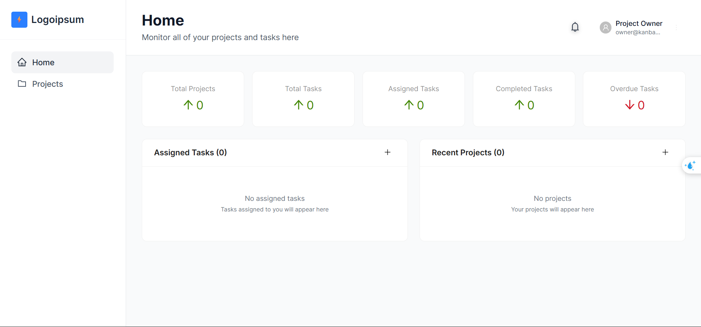
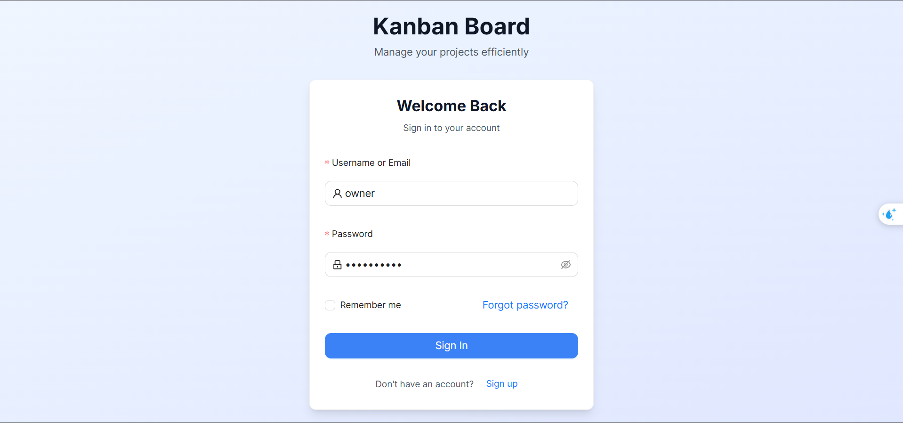
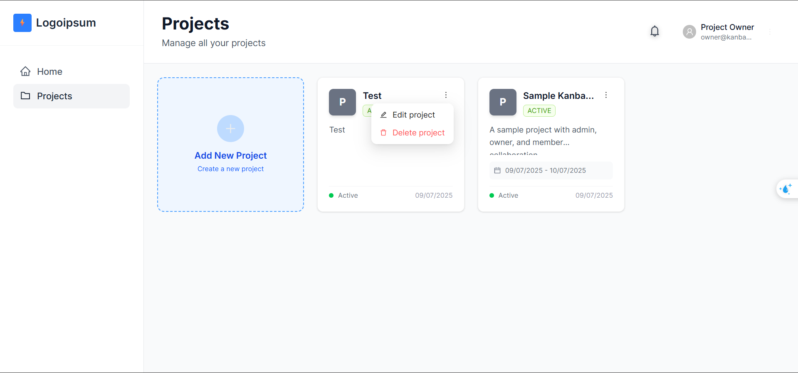
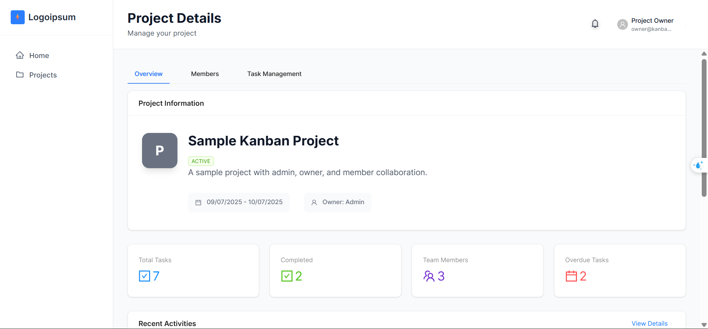
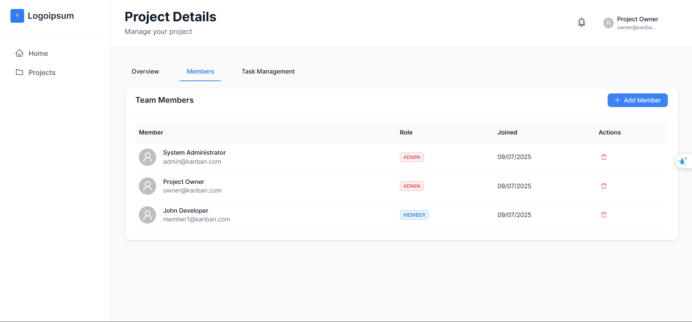
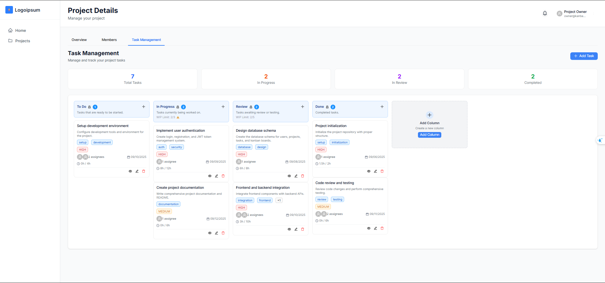
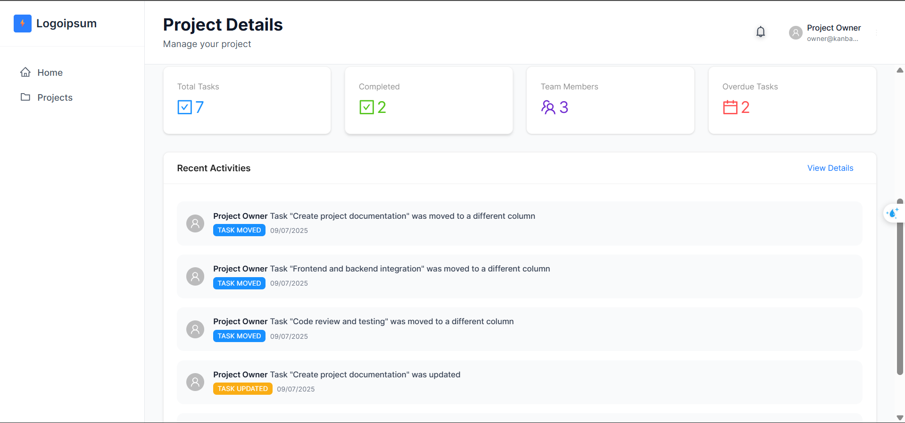
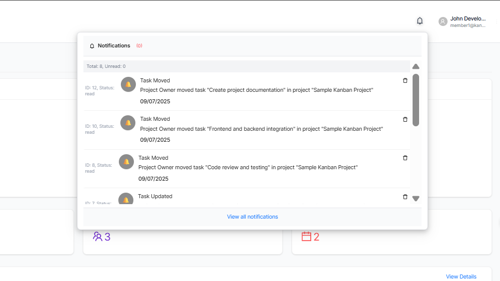

# 🎨 Kanban Frontend

Modern React/Next.js application for project management with real-time collaboration features.

## 🛠 Tech Stack

- **Framework**: Next.js 15 with App Router
- **Language**: TypeScript
- **UI Library**: Ant Design
- **Styling**: Tailwind CSS
- **State Management**: Redux Toolkit
- **HTTP Client**: Axios
- **Real-time**: Server-Sent Events (SSE)

## 🚀 Setup

### Prerequisites
- Node.js 18+
- npm or yarn

### Installation

```bash
# Navigate to frontend directory
cd fe

# Install dependencies
npm install

# Start development server
npm run dev
```


## 🎯 Key Features

### 🏠 Dashboard
- **Project Overview**: Display all user projects with statistics
- **Task Statistics**: Task count by status and priority
- **Recent Activity**: Latest activities across all projects
- **Quick Actions**: Create new project, quick task creation

### 📋 Project Management
- **Project Grid**: Grid view of project cards with basic information
- **Project Creation**: Create new projects with name, description, and avatar
- **Project Settings**: Project configuration and member management
- **Member Management**: Add/remove members with role-based permissions

### 📊 Kanban Boards
- **Drag & Drop**: Drag and drop tasks between columns using HTML5 API
- **Customizable Columns**: Create, edit, and delete Kanban columns
- **Task Cards**: Display task information on interactive cards
- **Real-time Updates**: Live updates when changes occur

### 📝 Task Management
- **Task Creation**: Comprehensive task creation form
- **Multiple Assignees**: Assign tasks to multiple team members
- **Task Details**: Detailed task view with comments and attachments
- **Comments System**: Collaborative commenting on tasks
- **File Attachments**: Attach files to tasks

## 📱 Main Screens

### 🏠 Home Page (Dashboard)
- **Layout**: Sidebar + Main content
- **Sidebar**: Navigation menu, project list
- **Main**: Overview statistics, recent activities
- **Header**: Logo, search, notification bell, user avatar

### 📋 Projects Page
- **Layout**: Grid view of project cards
- **Project Card**: Avatar, name, description, task count, members
- **Actions**: "Add New Project" button, dropdown menu for each project
- **Filter**: Filter by status, search functionality

### 📊 Project Detail Page
- **Tabs**: Overview, Members, Task Management
- **Overview Tab**: Project statistics, charts, recent activities
- **Members Tab**: Member list, pending invitations
- **Task Management Tab**: Kanban board with drag & drop

### 📝 Kanban Board
- **Columns**: Status columns (To Do, In Progress, Done, etc.)
- **Task Cards**: Display in each column with basic information
- **Drag & Drop**: Move tasks between columns
- **Add Task**: "+" button to create new task
- **Add Column**: "+" button to create new column

### 🔔 Notification System
- **Icon**: Bell icon with unread notification badge
- **Dropdown**: Notification list when clicked
- **Real-time**: Live updates when new notifications arrive

## 📸 Screenshots

### 🏠 Home Screen

*Home page displaying dashboard with sidebar navigation, overview statistics and recent activities*

### 🔐 Login Screen

*Login page with authentication form and link to registration page*

### 📋 Projects Screen

*Projects page with grid view of project cards and "Add New Project" button*

### 📊 Project Overview

*Overview tab in project detail page showing statistics, charts and project information*

### 👥 Project Members

*Members tab managing project members with member list and add new member form*

### 📝 Project Tasks (Kanban Board)

*Task Management tab with Kanban board, drag & drop functionality and task management*

### 🔔 Recent Activities

*Modal displaying recent activities in the project with filters and search*

### 🔔 Notifications

*Real-time notification system with bell icon and dropdown notification list*
